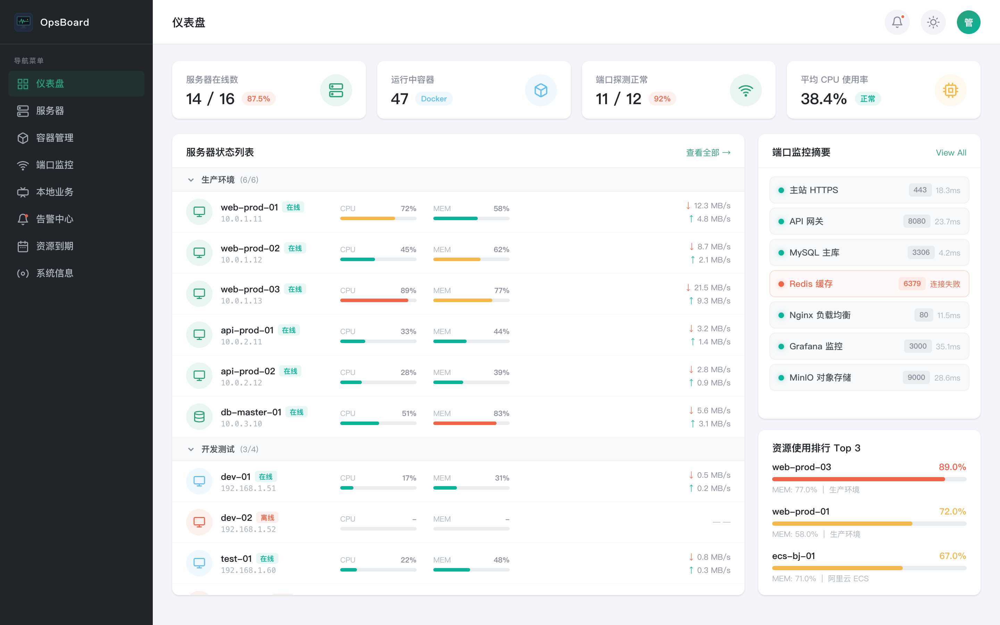

# MantisOps

轻量级智能运维平台 — 服务器监控、云资源管理、资产台账，未来集成 AI 日志分析与智能运维。


## 功能特性

- **服务器监控** — CPU、内存、磁盘、网络、负载、GPU 实时指标 + 历史趋势，Docker/GPU 自动检测
- **NAS 监控** — 群晖/飞牛 NAS 设备监控（RAID、S.M.A.R.T.、存储卷、UPS），SSH 采集
- **阿里云集成** — ECS 云监控（无需部署 Agent）+ RDS 数据库监控
- **端口探测** — TCP/HTTP/HTTPS 可用性检测 + SSL 证书到期监控 + 服务器自动扫描
- **告警引擎** — 16 种告警类型（含 NAS 告警）+ 钉钉/Webhook 通知
- **日志中心** — 操作审计 + 结构化运行日志 + 关键字搜索 + 实时尾随 + 导出
- **AI 分析** — 运维分析报告 + 智能对话
- **多用户权限** — admin/operator/viewer 三级角色 + 资源级权限 + 即时踢下线
- **托管业务** — 服务器资产信息管理
- **接入管理** — SSH 一键部署 Agent（含 sudo 密码支持）+ 阿里云账号自动发现 ECS/RDS
- **历史趋势** — 基于 VictoriaMetrics 的时序数据存储与查询
- **分组管理** — 服务器分组与排序（分组排序 + 组内服务器排序）

## 架构

```
浏览器 → Nginx → React SPA
  ├── /api/v1/* → Go Server (HTTP)
  ├── /ws       → WebSocket 实时推送
  └── /vm/*     → VictoriaMetrics

Go Server (HTTP + gRPC)
  ├── Agent(gRPC)       → 采集本机/远程服务器指标
  ├── AliyunCollector   → 阿里云 ECS/RDS API 采集
  ├── NasCollector(SSH) → 群晖/飞牛 NAS 指标采集
  ├── ProbeEngine       → 端口/HTTP 探测 + 自动扫描
  ├── AlertEngine       → 告警规则引擎
  ├── LogManager        → 结构化日志 + 操作审计
  └── SQLite            → 配置与元数据存储

VictoriaMetrics → 时序数据存储
```

## 技术栈

| 层 | 技术 |
|----|------|
| 前端 | React 19 + TypeScript + Tailwind CSS + Recharts |
| 后端 | Go（Gin + gRPC + SQLite） |
| Agent | Go（gopsutil + gRPC） |
| 时序库 | VictoriaMetrics |
| 反代 | Nginx |
| 云 SDK | alibabacloud-go/ecs + cms + rds + sts |

## 快速开始

### 前置要求

- Go 1.24+
- Node.js 20+
- Docker（用于运行 VictoriaMetrics）
- Nginx

### 1. 启动 VictoriaMetrics

```bash
docker run -d \
  --name mantisops-vm \
  --restart always \
  -p 127.0.0.1:8428:8428 \
  -v mantisops-vm-data:/victoria-metrics-data \
  victoriametrics/victoria-metrics:v1.117.1 \
  -retentionPeriod=90d
```

### 2. 配置并启动 Server

```bash
cd server

# 复制并编辑配置
cp configs/server.yaml.example configs/server.yaml
# 编辑 server.yaml，填入必填项：psk_token, auth.username, auth.password, jwt_secret, encryption_key

# 生成 encryption_key
openssl rand -hex 32

# 启动
go run ./cmd/server/
```

### 3. 构建并启动前端

```bash
cd web
npm install
npm run dev
```

访问 http://localhost:5173

### 4. 部署 Agent（在被监控服务器上）

```bash
# 编译
cd agent
GOOS=linux GOARCH=amd64 CGO_ENABLED=0 go build -o mantisops-agent ./cmd/agent/

# 创建配置
cat > /etc/mantisops/agent.yaml << EOF
agent:
  id: "srv-unique-id"
server:
  address: "your-server-ip:3101"
  token: "your-psk-token"
collect:
  interval: 5
  docker: true
  gpu: false
EOF

# 运行
./mantisops-agent
```

### 5. 生产部署

```bash
# 编译后端
cd server
go build -o mantisops-server ./cmd/server/

# 构建前端
cd web
npm run build

# 配置 Nginx（参考 deployments/nginx.conf）
# 使用 systemd 管理服务（参考 deployments/ 目录）
```

## 项目结构

```
mantisops/
├── agent/                    # Agent 采集端
│   ├── cmd/agent/            # 入口
│   └── internal/
│       ├── collector/        # 系统指标采集（CPU/内存/磁盘/网络/GPU/Docker）
│       └── reporter/         # gRPC 上报
├── server/                   # 服务端
│   ├── cmd/server/           # 入口
│   ├── configs/              # 配置文件
│   ├── internal/
│   │   ├── api/              # HTTP API + WebSocket
│   │   ├── alert/            # 告警引擎
│   │   ├── cloud/            # 云账号管理（发现/同步）
│   │   ├── collector/        # 阿里云 + NAS 指标采集
│   │   ├── config/           # 配置加载
│   │   ├── crypto/           # AES-256-GCM 凭据加密
│   │   ├── deployer/         # SSH Agent 部署器
│   │   ├── probe/            # 端口探测引擎
│   │   ├── store/            # SQLite 数据层
│   │   └── ws/               # WebSocket Hub
│   └── proto/                # Protobuf 定义
├── web/                      # React 前端
│   └── src/
│       ├── api/              # API 客户端
│       ├── components/       # 通用组件
│       ├── pages/            # 页面
│       ├── stores/           # Zustand 状态管理
│       └── hooks/            # 自定义 Hooks
└── deployments/              # 部署配置（Nginx 等）
```

## 截图



## License

本项目采用 [Business Source License 1.1 (BSL-1.1)](LICENSE) 许可。

- **个人/教育/非营利用途**：免费使用
- **商业用途**：需购买商业许可证，联系 yuanqing19920927@gmail.com
- **开源转换**：2030-03-28 后自动转为 Apache 2.0 许可证

详见 [LICENSE](LICENSE) 文件。
